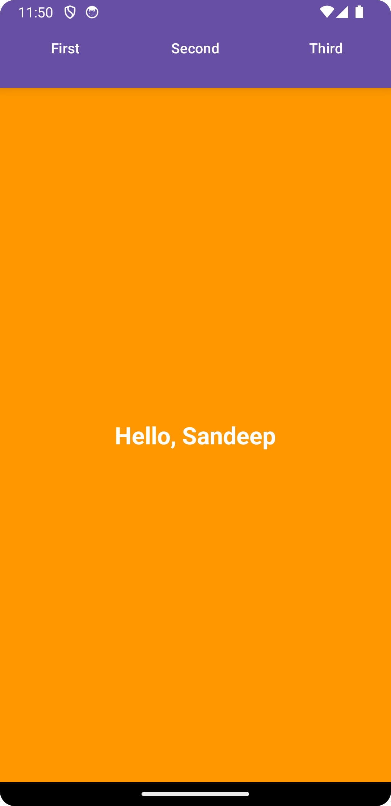

# ViewPager2 with TabLayout Example

This Android application demonstrates the use of ViewPager2 with TabLayout to create a swipeable tabbed layout containing multiple fragments.

## Overview

The app contains:
- `MainActivity` as the entry point.
- `ViewPagerAdapter` to manage fragments within the ViewPager2.
- Fragments (`AFragment`, `BFragment`, `CFragment`) each displaying unique content.

## Setup

### ViewPager2 and TabLayout

1. **Layout Setup:**
    - `activity_main.xml`: Contains the ViewPager2 and TabLayout.
    - `fragment_layout.xml`: Layout file for individual fragments.

2. **Adapter Setup:**
    - `ViewPagerAdapter`: Manages the fragments for ViewPager2.

3. **Fragment Initialization:**
    - Fragments (`AFragment`, `BFragment`, `CFragment`) are initialized and added to the adapter.

4. **Passing Data to Fragments:**
    - User's name is passed to each fragment from MainActivity using Bundle.

### Fragments

- Each fragment displays a unique layout and content.
- Retrieved the user's name from the arguments bundle to display a personalized greeting.

## How to Use

1. Clone or download the repository.
2. Open the project in Android Studio.
3. Build and run the app on an emulator or Android device.

## Implementation Notes

- The `ViewPagerAdapter` extends `FragmentStateAdapter` and manages the fragments' lifecycle.
- `TabLayoutMediator` is used to link the TabLayout with ViewPager2 for tab management.
- Fragments retrieve user data from arguments bundles for personalized content display.

## Screenshots

- 
- 

## Contributing

Feel free to contribute to this project by submitting pull requests.

## License

This project is licensed under the [MIT License](LICENSE).

